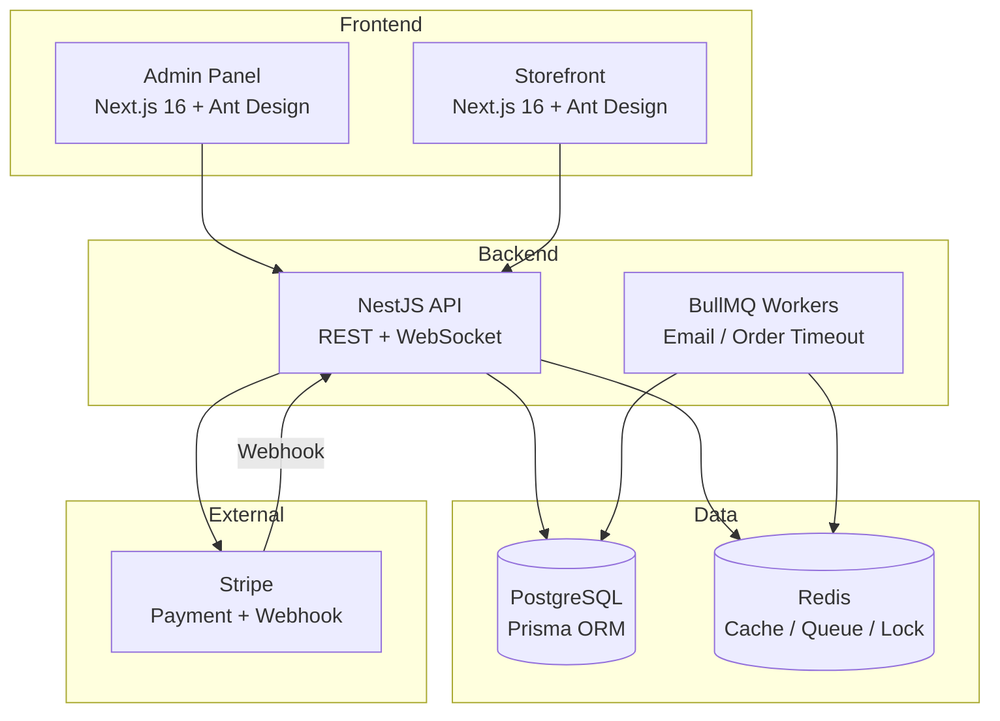

# EcomAdmin — 电商管理系统

基于 **NestJS + Next.js** 的全栈电商管理后台，涵盖商品管理、订单管理、用户权限（RBAC）、支付集成、优惠券营销、通知中心等完整功能模块。

## 技术架构



## 项目结构

```
EcomAdmin-API/
├── apps/
│   ├── server/                  # NestJS 后端 API 服务
│   │   ├── prisma/              # Schema + Migrations + Seed
│   │   └── src/
│   │       ├── common/          # 全局模块：拦截器/过滤器/日志/DTO/装饰器
│   │       ├── modules/         # 业务模块
│   │       │   ├── auth/        # JWT 认证 + Passport
│   │       │   ├── rbac/        # RBAC 角色/权限守卫
│   │       │   ├── user/        # 用户管理
│   │       │   ├── category/    # 分类管理（树形）
│   │       │   ├── brand/       # 品牌管理
│   │       │   ├── spec/        # 规格/规格值管理
│   │       │   ├── product/     # 商品管理（SPU+SKU）
│   │       │   ├── inventory/   # 库存管理（Redis 分布式锁）
│   │       │   ├── upload/      # 文件上传（Sharp 缩略图）
│   │       │   ├── cart/        # 购物车（Redis Hash）
│   │       │   ├── order/       # 订单管理（状态机 + 事务）
│   │       │   ├── coupon/      # 优惠券（发放 + 核销）
│   │       │   ├── payment/     # Stripe 支付
│   │       │   ├── notification/# 通知中心（WS + 站内信 + 邮件队列）
│   │       │   └── operation-log/# 操作日志拦截器
│   │       ├── prisma/         # PrismaService + 全局模块
│   │       ├── redis/          # Redis 连接 + 服务封装
│   │       └── i18n/           # 多语言资源文件
│   ├── admin/                   # 管理后台前端 (Next.js)
│   │   └── src/
│   │       ├── lib/             # API 客户端 + Auth Context
│   │       ├── components/      # Sidebar / Header / Providers
│   │       └── app/             # 路由页面
│   └── storefront/              # 用户端商城 (Next.js)
│       └── src/
│           ├── lib/             # API 客户端
│           ├── components/      # StoreHeader / Providers
│           └── app/             # 商城页面
├── packages/
│   ├── shared-types/            # 前后端共享 DTO/类型定义
│   └── eslint-config/           # 统一 ESLint 规则
├── docs/                        # 各阶段学习文档
├── docker-compose.yml           # 本地开发环境
├── docker-compose.prod.yml      # 生产部署
├── Dockerfile                   # 多阶段构建
└── pnpm-workspace.yaml
```

## 功能模块

| 模块              | Admin        | Storefront | 技术要点                                        |
| ----------------- | ------------ | ---------- | ----------------------------------------------- |
| 用户与权限 (RBAC) | ✅           | —          | JWT 双 Token + Passport + Role/Permission Guard |
| 商品管理          | ✅           | ✅ 浏览    | 分类树 + SPU/SKU 多规格 + 图片上传 Sharp        |
| 库存管理          | ✅ 出入库    | —          | Redis SET NX 分布式锁防超卖                     |
| 订单管理          | ✅ 状态流转  | ✅ 下单    | 状态机 + Prisma $transaction                    |
| 购物车            | —            | ✅         | 未登录 localStorage / 已登录 Redis Hash         |
| 支付              | ✅ 管理      | ✅ 支付    | Stripe Checkout + Webhook 异步回调              |
| 优惠券            | ✅ CRUD+发放 | —          | 固定金额/百分比 + 多维度校验                    |
| 通知中心          | ✅           | —          | 站内信 + WebSocket + BullMQ 邮件队列            |
| 操作日志          | ✅ 查看      | —          | Interceptor AOP 自动捕获                        |
| 国际化            | ✅ 中/英     | —          | nestjs-i18n + Accept-Language                   |

## 快速开始

### 前置要求

- Node.js >= 20
- pnpm >= 9
- Docker Desktop（PostgreSQL + Redis）

### 1. 克隆项目

```bash
git clone <repo-url>
cd EcomAdmin-API
```

### 2. 启动基础设施

```bash
docker compose up -d
```

### 3. 安装依赖

```bash
pnpm install
```

### 4. 初始化数据库

```bash
cd apps/server
pnpm exec prisma migrate dev
pnpm exec tsx prisma/seed.ts
```

### 5. 启动后端

```bash
pnpm dev:server           # → http://localhost:3000
# Swagger 文档: http://localhost:3000/api/docs
```

### 6. 启动前端

```bash
pnpm dev:admin            # Admin Panel → http://localhost:3001
pnpm dev:storefront       # Storefront  → http://localhost:3002
```

### 默认管理员

| 邮箱           | 密码     |
| -------------- | -------- |
| admin@ecom.com | admin123 |

## 测试

```bash
# 单元测试
pnpm --filter @ecom/server test

# E2E 测试
pnpm --filter @ecom/server test:e2e
```

## 生产部署

```bash
docker compose -f docker-compose.prod.yml up -d
```

## API 文档

启动后端后访问：http://localhost:3000/api/docs

全量 Swagger 文档，含 Bearer Auth 认证、分组标签、请求示例。

## 技术亮点

- **后端**：NestJS 企业级架构 + Prisma 7 ORM + JWT 双 Token + RBAC 权限 + 订单状态机
- **前端**：Next.js 16 App Router + Ant Design + TanStack Query + Axios 拦截器自动刷新
- **数据**：PostgreSQL (主库) + Redis (缓存/队列/分布式锁/购物车)
- **异步**：BullMQ 延迟队列（订单超时取消） + 邮件队列
- **支付**：Stripe Checkout 托管支付 + Webhook 异步回调签名验证
- **工程化**：pnpm workspace Monorepo + ESLint + Prettier + Husky + Commitlint + GitHub Actions CI
- **测试**：Jest 单元测试 (13+ tests) + Supertest e2e 测试 (7 步完整流程)
- **安全**：bcrypt 加密 + JWT 认证 + 全局 ValidationPipe + Rate Limiting + Webhook 验签
- **容器化**：Docker 多阶段构建 + 开发/生产 docker-compose 分离
- **国际化**：nestjs-i18n 中/英文切换
- **日志**：Winston 结构化日志（控制台 + 文件）+ 操作日志 AOP 拦截

## 阶段学习文档

| 阶段 | 内容                     | 文档                                                 |
| ---- | ------------------------ | ---------------------------------------------------- |
| 1    | 项目初始化与后端基础架构 | [docs/phase-1-learning.md](docs/phase-1-learning.md) |
| 2    | 认证、权限与国际化       | [docs/phase-2-learning.md](docs/phase-2-learning.md) |
| 3    | 商品管理模块             | [docs/phase-3-learning.md](docs/phase-3-learning.md) |
| 4    | 订单与购物车管理         | [docs/phase-4-learning.md](docs/phase-4-learning.md) |
| 5    | 支付、营销与通知         | [docs/phase-5-learning.md](docs/phase-5-learning.md) |
| 6    | 管理后台前端 (Admin)     | [docs/phase-6-learning.md](docs/phase-6-learning.md) |
| 7    | 用户端商城 (Storefront)  | [docs/phase-7-learning.md](docs/phase-7-learning.md) |
| 8    | 测试、优化与部署         | [docs/phase-8-learning.md](docs/phase-8-learning.md) |

## License

MIT
